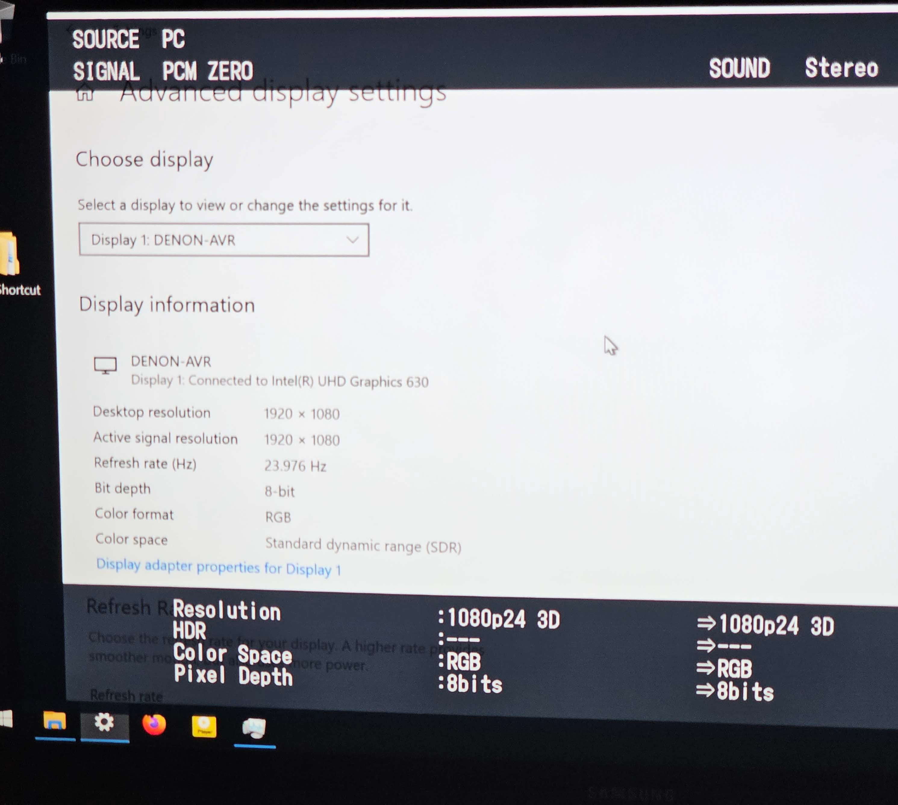
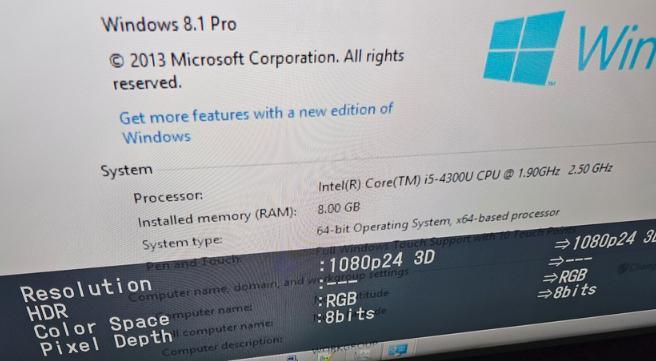
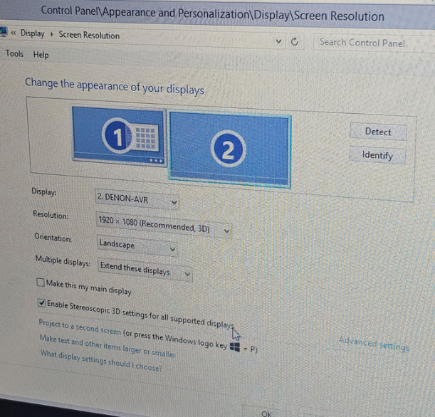
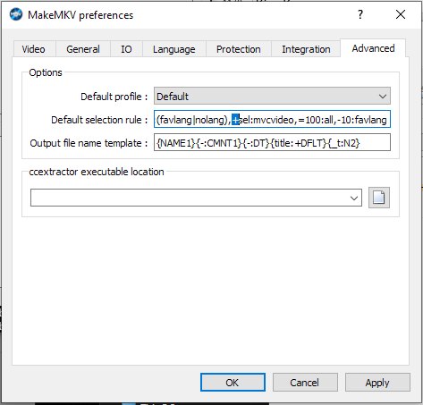

# Stereoscopic 3D

Play games and 3D media, like MVC-encoded 3D Blu-ray movies, in full-res stereo on Windows.

See also [media-scripts/bd3d](https://github.com/xenago/media-scripts/tree/main/bd3d) for more Blu-ray 3D notes.

## Vendor 3D Support

### Windows 3D Support

* Stereoscopic 3D support was officially added in [Windows 8](https://learn.microsoft.com/en-us/windows-hardware/drivers/display/stereoscopic-3d), but [Windows 7 is apparently supported with the Platform Update](https://learn.microsoft.com/en-us/windows/win32/api/dxgi1_2/nn-dxgi1_2-idxgidisplaycontrol)
* Windows 10 1809-based builds are the last officially supported by Microsoft for 3D output
  * Newer drivers/OS releases are far more limited for DirectX/games
  * That said, newer builds still work fine for 3D video playback (last tested with Windows 10 22H2 build 19045.5371, released in mid-January 2025)

### Nvidia 3D Support

3D playback works well with Nvidia hardware, and is the primary focus of this document as it requires additional setup.

Official support for stereo 3D has ended from Nvidia:

* The last [official consumer driver release is version `425.31`](https://nvidia.custhelp.com/app/answers/detail/a_id/4781/~/support-plan-for-3dvision-products)
   * As noted, this also includes the 3DTV Play components necessary for frame-packed output to HDMI 1.4a devices like HDTVs and projectors, so it is possible to use either the Nvidia 3D Vision kit with shutter glasses, or dedicated 3D display devices
* The Ampere generation (e.g. RTX 3080) and subsequent hardware releases are not supported by the final 3D Vision driver; as such, the RTX 2080ti is the most powerful consumer GPU with full official 3D Vision compatibility

It is possible to [get Nvidia 3D Vision working with newer GPUs using the studio driver](https://www.mtbs3d.com/phpbb/viewtopic.php?p=188137&sid=dfed06fd1d35acaa5a8479995016452f#p188137).

### Intel 3D Support

Some Intel iGPUs support stereo 3D output in Windows out of the box. I can confirm it is present from at least the Haswell era until at least Coffee Lake, and works with Windows 8.1 and Windows 10. Based on the [tables present on Wikipedia](https://en.wikipedia.org/wiki/Intel_Graphics_Technology?useskin=vector), it seems likely that models as old as Ivy Bridge and as new as Rocket Lake support it, excluding anything with Iris Xe or Arc integrated GPUs. As of 2024-12-23, [Intel has officially discontinued support](https://www.intel.com/content/www/us/en/support/articles/000093215/graphics/processor-graphics.html) for Stereoscopic 3D output for Alder Lake / Arc architectures onwards. The best indication that an Intel system supports 3D is the presence of an HDMI 1.4 output (not HDMI 2.0 or newer).

HDMI 3D output works using a Coffee Lake [i5-8500T with UHD Graphics 630](https://www.intel.com/content/www/us/en/products/sku/129941/intel-core-i58500t-processor-9m-cache-up-to-3-50-ghz/specifications.html) on Windows 10 22H2 (specifically, a Dell OptiPlex 3060 Micro mini PC):

The `3D display mode` toggle was present in the Settings app without any additional configuration. With it enabled, proper HDMI frame-packed 3D was immediately active. 

Although the Windows interface was a bit buggy with 3D mode enabled, media playback was good and entire films play without issue. Here is an example image showing 36 minutes of 3D playback in PotPlayer on Windows 10 using the i5-8500T with zero dropped frames:

System performance is solid, with 20-25% total system CPU usage (including additional TrueHD audio decoding overhead) and some headroom on the GPU:

3D output also worked in my testing of a Haswell-era [i5-4300U with HD Graphics 4400](https://www.intel.com/content/www/us/en/products/sku/76308/intel-core-i54300u-processor-3m-cache-up-to-2-90-ghz/specifications.html) on Windows 8.1:

The `Stereoscopic 3D (Windows 8 Native 3D)` output option in PotPlayer had to be activated first to enable proper HDMI frame-packed 3D display output in the Windows 8.1 Control Panel. With that option enabled, stereoscopic content was displayed on a 3DTV over HDMI:

However, performance was occasionally choppy and imperfect. I suspect a faster Haswell CPU would work fine since the issue was on the MVC/video playback side and not the output side.

### AMD

Supposedly, 3D output over HDMI can be made to work with some older generations of AMD APUs, possibly up to the 5600G. I have not been able to confirm this yet.

I tested the Rembrandt-generation AMD Ryzen 5 6600H with the Radeon 660M iGPU (specifically, a Trigkey S6 mini PC), and that did not work for 3D output in my testing on either Windows 10 or Windows 11.

### Other

There is a [third party S3D Emitter solution](https://en.gradient-sg.com/s3d/emitter.php), but I have not had much luck with it in testing.

## Downloading 3D Blu-ray media to PC

3D media is usually obtained by buying 3D Blu-ray discs. These are encumbered by DRM that can be worked around with MakeMKV to produce playable digital versions.

When MakeMKV is first installed, the 3D MVC video track is not selected by default. To fix this, update the default selection rules.

In `View > Preferences`, select the `Advanced` tab and for the `Default selection rule` make sure to change `-sel:mvcvideo` to `+sel:mvcvideo`. 

## Nvidia 3D Vision PC Setup

1. Install Nvidia driver using [3D Fix Manager](https://helixmod.blogspot.com/2017/05/3d-fix-manager.html)

    * Purge old driver with [DDU](https://www.guru3d.com/download/display-driver-uninstaller-download/) if the OS and GPU both support the final full 3D Vision driver release
    * [3D Fix Manager 1.87 is mirrored here](https://github.com/xenago/win-scripts/raw/main/3d/fix_manager_1.87.7z) as the download seems spotty (the whole thing is somewhat janky but it provides a convenient GUI for driver setup and a tray icon for toggling frame-packed 3D output)
    * Set up 3D resolutions and configuration as desired for your setup
      * The only ones I have used are 1080p24 and 720p60 as those are the only ones relevant for my display, but supposedly [720p50 is supported by the 3D Blu-ray standard as well](https://www.videohelp.com/hd)
    * If `Generic CRT` is not available in the 3D Vision menu, use [Custom Resolution Utility](https://www.monitortests.com/forum/Thread-Custom-Resolution-Utility-CRU) to [change the display EDID](https://www.mtbs3d.com/phpbb/viewtopic.php?t=25526) to `GSMC0A0` or `OTM0076`

2. Install [PotPlayer](https://www.videohelp.com/software/PotPlayer/old-versions), performing the full codec install (including the Intel MVC decoder - it works with AMD CPUs too).

3. Configure PotPlayer to decode 3D MVC and output with Nvidia 3D Vision

    * Although I believe it is worth becoming comfortable with PotPlayer since it is free and powerful, paid software like [Stereoscopic Player](https://www.3dtv.at/Index_en.aspx) or Cyberlink can be helpful for 3D playback as well
    * Generally, it is enough to enable the Intel MVC decoder and automatic 3D detection and set output to Nvidia 3D Vision:
      1. Open PotPlayer settings (right click playing area > `Preferences`)
      2. `Video` section > `3D Mode` tab > select `Enable H.264 MVC 3D Decoder`
      3. For `3D Video Mode`, select `Auto enable 3D Video Mode`
      4. In the `Output (Screen)` dropdown, select `NVIDIA 3D Vision`
      5. Exclusive fullscreen may be required, especially with shutter glasses, so in the `Fullscreen exclusive mode` dropdown select `Enable: Fastest`
    * In some cases it appears necessary to use the [Nvidia Profile Inspector](https://github.com/Orbmu2k/nvidiaProfileInspector/releases)
      1. Select the `DaumPot Player` profile
      2. Click the `A+` button and navigate to `C:\Program Files\DAUM\PotPlayer\PotPlayerMini64.exe` to add it to the profile
      3. In section `7 - Stereo`, set `Stereo - Enable` to `0x00000001 WKS_STEREO_SUPPORT_ON`

4. Exit PotPlayer, enable 3D in 3D Fix Manager (the display should switch to 3D mode at this point), start PotPlayer back up and it should support 3D output with MVC-encoded content in ISO and MKV form. It will also support playing SBS/OU format content output in frame-packed format via 3D Vision.

### Nvidia 3D Vision 2 Glasses Configuration

It is possible to use the shutter glasses kit with display models not advertised with official 3D support. My test setup is as follows:

* Glasses kit model: `Nvidia 3D Vision 2 Wireless Glasses Kit (942-11431-0007-001)`
* Monitor: `Acer XB271HU bmiprz` (IPS version)
  * The TN version is `Abmiprz` and may be better for 3D since it has a faster response time
* Also successfully tested on Asus IPS monitors with "ELMB" support

In addition to the previous setup, the USB emitter driver must be installed if it is not done automatically:

1. Extract `NV3DVisionUSB.Driver` from `425.31-desktop-win10-64bit-international-whql.exe`
2. Plug in the 3D Vision 2 emitter
3. Open `Device Manager`
4. Locate the emitter in the `USB Devices` section as `NVIDIA Stereoscopic 3D USB controller`
5. Attempt to update the driver, and locate `NV3DVisionUSB.Driver` when it fails and asks for the driver files

3D software like PotPlayer should now work in fullscreen exclusive mode after 3D has been enabled! Make sure to turn on the charged glasses using the button on the left side if they do not turn on automatically using the accelerometer.

### Dedicated HTPC Configuration

This section is for use as a dedicated media-only HTPC.

#### OS install

   **Although not necessary for movie playback**, Windows 10 1809 can be used for wider compatibility with 3D Vision games.

   * Windows 10 ISO: `en_windows_10_enterprise_ltsc_2019_x64_dvd_5795bb03.iso`
   * SHA1: `615A77ECD40E82D5D69DC9DA5C6A6E1265F88E28`
   * Generic KMS key [from Microsoft](https://learn.microsoft.com/en-us/windows-server/get-started/kms-client-activation-keys?tabs=server2022%2Cwindows10ltsc%2Cversion1803%2Cwindows81#windows-enterprise-ltsc-and-ltsb), may be useful: `M7XTQ-FN8P6-TTKYV-9D4CC-J462D`
   * Download ISO and activate using usual methods

#### OS Configuration

   * Disable Windows update from downloading drivers (to avoid Nvidia driver being overwritten in the future)
   * Recommended:
     * Install clients for Plex, Jellyfin, VLC, etc.
     * Disable automatic Windows updates
     * Disable unnecessary startup tasks
     * Configure mounted network drives/storage with read-only accounts for HTPC use

#### PotPlayer HDMI Audio Passthrough

It is useful to bitstream audio losslessly over HDMI, particularly to preserve object-based surround formats like Dolby Atmos & DTS:X.

1. Ensure that `Exclusive` mode is enabled for your HDMI audio device (this will lock the dedicated application to the audio device for bitstreaming audio and prevent regular PCM output from the Windows mixer)
    1. Open `Control Panel`
    2. Open the `Sound` menu
    3. In `Playback`, open the device connected for HDMI audio
    4. In the `Advanced` tab, enable the `Exclusive Mode` options (`Allow applications to take exclusive control` and `Give exclusive mode applications priority`)
2. Open PotPlayer settings (right click playing area > `Preferences`)
3. Open the `Audio` section
    1. Set the `Audio Renderer` to `Built in WASAPI Audio Renderer`
    2. Set the `Speakers` accordingly for your setup (used only when not bitstreaming audio, i.e. any content that is not in DTS or Dolby codecs)
4. Click the `...` button to configure the `Built in WASAPI Audio Renderer`
    1. Set the HDMI audio device as the output
    2. Enable the option to `Use exclusive mode` (`Switch to bitexact` may be needed but didn't seem to be in my testing)
5. Click `Set Built-in Audio Decoder`
    1. Activate `Enable (Pass-through/Bitstreaming)`
    2. On the right, select `Default Pass-through Muxer` for each option supported by the output HDMI chain: `AC3`, `EAC3`, `TrueHD`, `DTS`, and `DTS-HD`
    3. If specific formats do not work, a different Muxer can be selected instead for that format
    4. In my case, DTS/DTS-HD only worked with the `Alternative Pass-through Muxer`
6. Restart PotPlayer

## Untested

1. [Kodi Forum:	`[Win][v19+] Intel HTPCs/NUCs & Kodi-native 3D MVC Playback`](https://forum.kodi.tv/showthread.php?tid=365120)

   The installer appears to be `KodiSetup-v20.0.2-05d7303c-mvc-upstream-x64.exe`

2. [ThreeDeeJay's PotPlayer scripts](https://github.com/ThreeDeeJay/PotPlayer3D/releases/tag/1.2.0)
